# Project: Functional MRI study of children diagnosed with APD

## Introduction
This study explores brain network organization in children with Auditory Processing Disorder (APD) using resting-state fMRI data and graph theory approaches. Key findings include differences in brain hub architecture and functional connectivity between children with APD and healthy controls, particularly in regions related to auditory processing.

## Background
**Problem Statement:** Auditory Processing Disorder (APD) leads to difficulties in understanding speech despite normal hearing. The origins of APD symptoms are debated, with limited knowledge on the role of altered brain network topology.

**Objectives:** To investigate the functional brain network organization in children with APD and compare it with healthy controls using advanced neuroimaging techniques and network science approaches.

## Methods

### Population for collecting multi-modal data
- 66 children (57 included) aged 8-14 years old (28 with diagnosis of APD and 29 healthy controls).

### Data type
- functional MRI (rs-fMRI) data acquired by multi-echo multi-band imaging sequences

### Analysis Techniques
- Complex network analysis using graph theory, focusing on global and nodal network properties, and brain hub architecture

<!-- 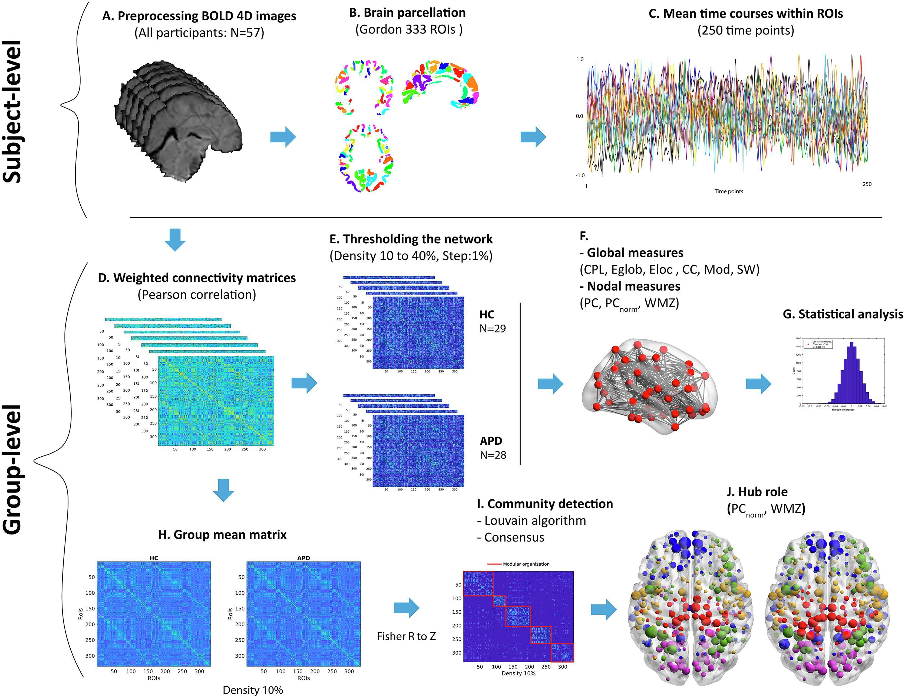 -->

<!--  -->

<!-- for compatibility with screen sizes -->
 

Figure 1: The pipeline used in this project for analyzing the imaging data.

## Results

### Global Network Properties
- Both APD and control groups showed similar global network properties, but differences emerged in hub architecture

  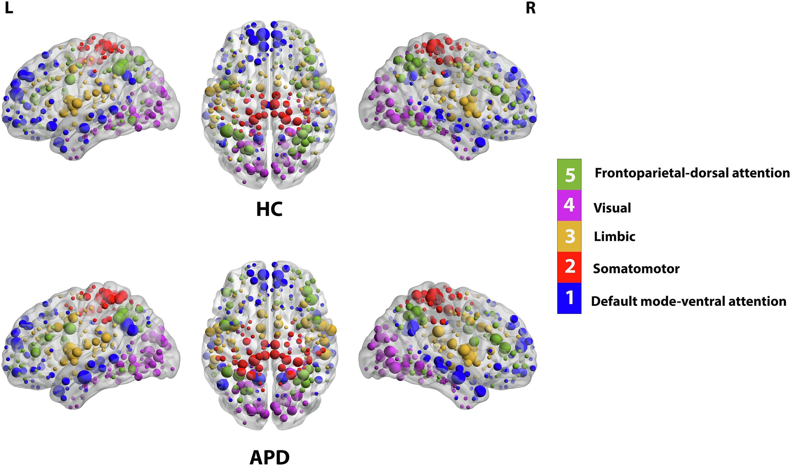
  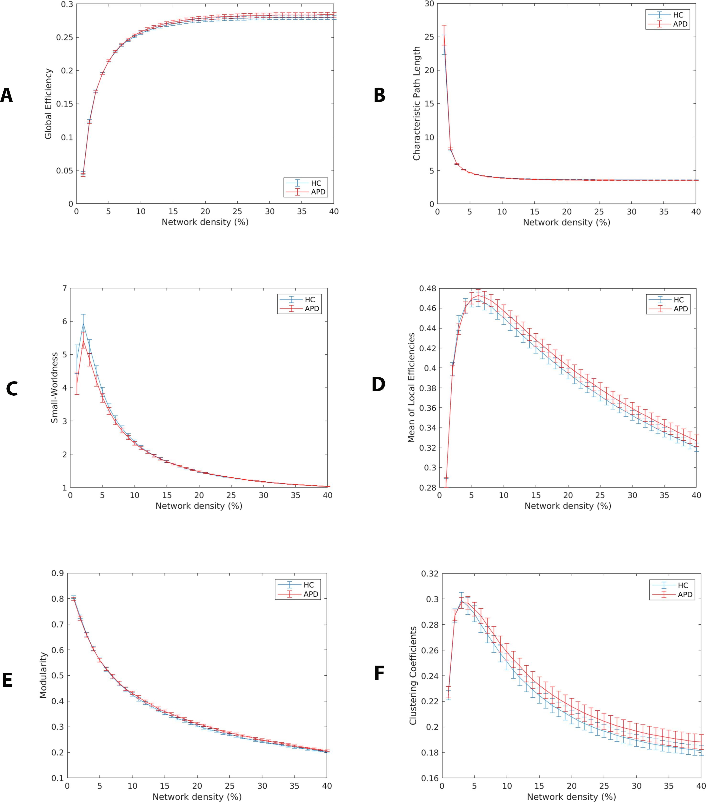

<!--

  
  

-->

Figure 2: Similar brain hub architecture and <a href="https://en.wikipedia.org/wiki/Large-scale_brain_network">intrinsic network model</a> in both APD and HC (Left) as shown by their global network metrics (right).

### Key Findings
- Decreased participation coefficient in auditory cortical regions (<a href="https://www.sciencedirect.com/topics/neuroscience/superior-temporal-gyrus#:~:text=The%20superior%20temporal%20gyrus%20is,short%2Dterm%20auditory%20sensory%20memory.">bilateral superior temporal gyrus</a>) in children with APD, suggesting altered functional connectivity in specific brain networks (<a href="#target-image1">Figure 3: Left</a>).
- Positive correlation between left  <a href="https://www.sciencedirect.com/topics/neuroscience/parahippocampal-gyrus">parahippocampal gyrus </a> connectivity and auditory perception tasks in children with APD (<a href="#target-image2">Figure 3: Right</a>).

  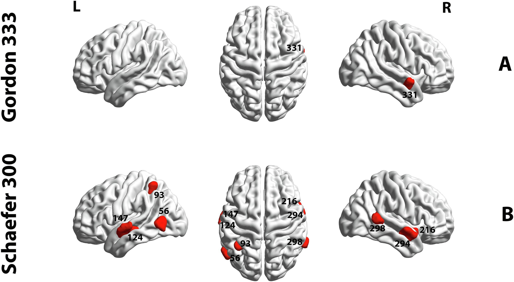
  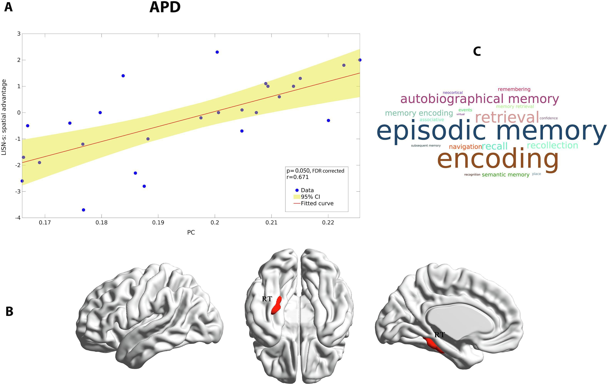

Figure 3: Major differences in brain regional network in APD and HC based on network metrics.

## Discussion
The findings suggest that children with APD have distinct alterations in brain network topology, particularly in regions associated with auditory processing. These results provide new insights into the neural mechanisms underlying APD and highlight the potential for using advanced neuroimaging and network science approaches to further our understanding of auditory processing disorders.

## Conclusion
This study contributes to the understanding of brain network alterations in APD, with potential implications for developing targeted interventions.

## Publication and Citation
**Read the article:** [here](https://www.sciencedirect.com/science/article/pii/S2213158222002042)

**Citation:** Alvand et al., (2022). Altered brain network topology in children with auditory processing disorder: A resting-state multi-echo fMRI study. *NeuroImage: Clinical, 35*, 103139.

## Funding
This study was funded by [Eisdell Moore Centre](https://www.emcentre.ac.nz/) and Faculty of Science's Research fund from [the University of Auckland](https://www.auckland.ac.nz/en.html).

# Data science behind the study
In this project, range of different approaches were used to treat the data such as formatting 4D imaging dataset (DICOM --> NIFTI), re-arranging data structure into brain Imaging Data structure (BIDS), quality inspection for evaluating spurious data (MRIQC), evaluation of de-noising pipelines, modeling data based on the theory of graph as well as statistical analysis.

## fMRI data
When acquiring functional MRI (fMRI) data from a scanner, the output includes a complex array of raw and processed data that captures both structural and functional aspects of the brain (Figure 4: Right).

In addition to functional data, a high-resolution structural MRI scan is often acquired. This provides a detailed map of the brain’s anatomy, which is used for aligning and localizing functional data to specific brain regions (Figure 4: Left).

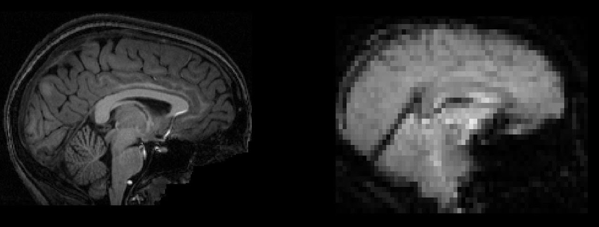 

Figure 5: Demonstration of anatomical MRI data, T1-image (left) and fMRI data (right)

## Raw fMRI Data (DICOM Files)
- Format: The raw data from the MRI scanner is typically stored in Digital Imaging and Communications in Medicine (DICOM) format. Each DICOM file contains a 2D slice of the brain, along with metadata (e.g., patient information, acquisition parameters like slice thickness, and time of acquisition).

- Slices and Volumes: The scanner acquires brain images in slices (2D planes) that are stacked together to form a 3D volume. A single fMRI acquisition consists of a series of 3D volumes captured over time (time series), producing a 4D dataset (3D volumes over time).

<!-- for compatibility with screen sizes -->
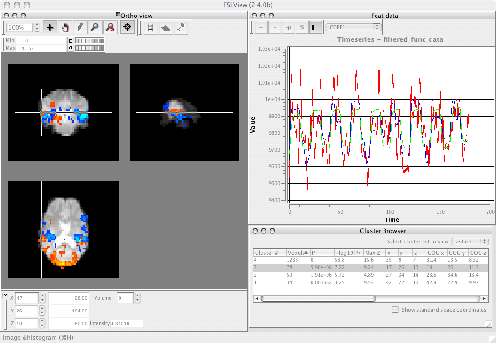 

Figure 6: Depiction of fMRI data (3D) and its time series in FSL software

## Data Organization steps

- NIfTI Format
The raw ([DICOM](https://www.dicomstandard.org/about) files are often converted into a more standardized format, such as the Neuroimaging Informatics Technology Initiative (NIfTI) format. NIfTI files contain the 3D brain volumes (or 4D volumes with time) and are easier to work with for analysis.

- fMRI data is stored and organized using the Brain Imaging Data Structure (BIDS) format, a standardized way of organizing raw, processed, and metadata associated with neuroimaging datasets. This standard makes sharing and analysis more consistent and reproducible.

### 1. Data conversion and restructuring

[DICOM](https://www.dicomstandard.org/about) images were first reformatted to NIFTI using [dcm2niix](https://github.com/rordenlab/dcm2niix) and then re-structured into BIDS data structure using [niix2bids (Python)](https://github.com/benoitberanger/niix2bids). 

  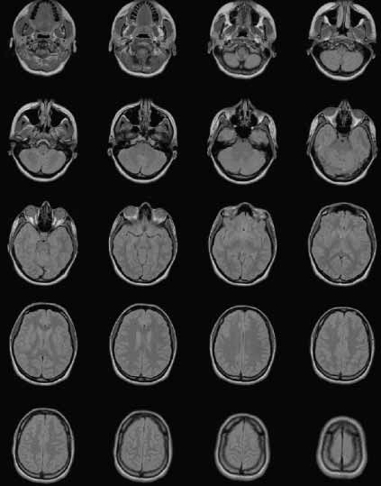
  

Figure 7: Transforming DICOM images (Left) to NIFTI format (4D data point) according to BIDS structure (Right)

## Computer Vision
### 1. Data Quality (QC)
In order to assess the quality of each data for pre-processing, first each NIFTI data was visualized and evaluated against their quality control (QC) parameters such as FD (a measurement of how much the head moves from one frame to the next), DIVARS (derivatives of FD), etc. as well as their [carpet plot](https://www.nature.com/articles/s41598-021-86402-z#:~:text=A%20%E2%80%9Ccarpet%20plot%E2%80%9D%20is%20a,of%20neuronal%20and%20physiological%20activity.) ( 2-dimensional plot of scaled fMRI voxel intensity values).

This pipeline is written in Bash and utilizes the [MRIQC](https://github.com/nipreps/mriqc/tree/master) (Python tool) for data quality assessment.

<!-- for compatibility with screen sizes -->
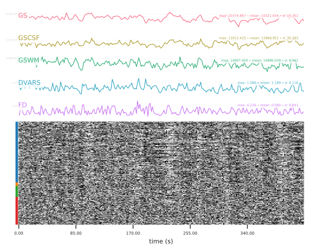 

Figure 5: Visualized NIFTI data according to its quality measures

### 2. Image pre-processing

After discarding data points that did not meet the QC requirement, the remained data were undergone sequences of cleaning procedure, for example, image transformations, head motion correction, spatial normalization and spatial smoothing. This procedure utilizes [fMRIPrep](https://fmriprep.org/en/stable/), neuroimaging standard pipeline for minimal image cleaning (Figure 6). 

<!-- for compatibility with screen sizes -->
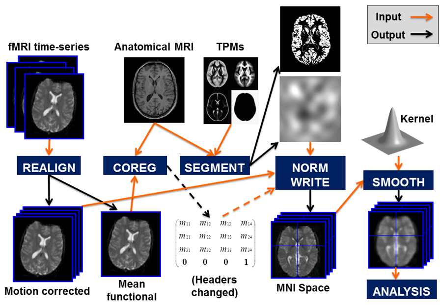 

Figure 6: Some of the fMRI image pre-processing steps

### 3. Selection of optimal de-noising pipelines

After each data was minimally processed, each data point were gone through further cleaning procedure to remove motion and confound signals from fMRI signal ([BOLD signal](https://radiopaedia.org/articles/bold-imaging)). For this, multiple existing de-noising pipelines were tested against efficiency and efficacy indices for accuracy performance. For instance, Figure 7 highlights the highest score of ICA-AROMA+8Phs+4GSR (High QC-FC, Low QC-FC dependence) among the rest of popular de-noising pipelines for the project's fMRI dataset.

<!-- for compatibility with screen sizes -->
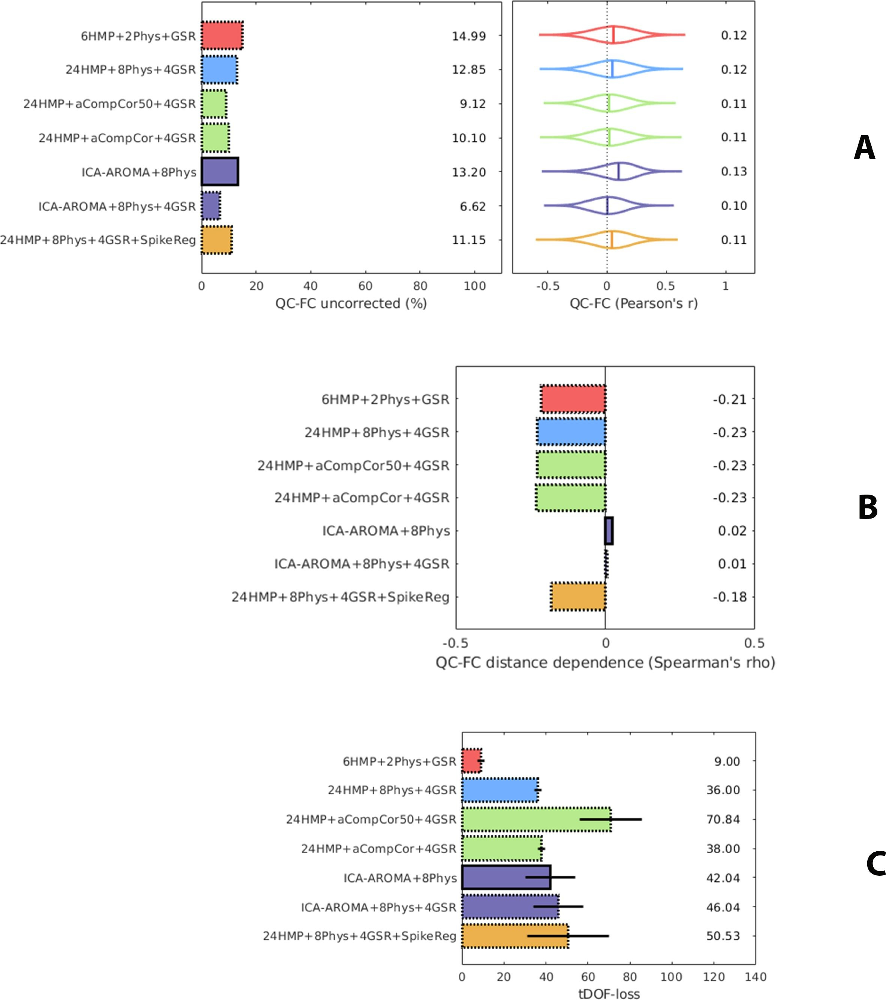 

Figure 7: Evaluating the accuracy of de-noising pipelines 

## Modeling the fMRI data 

### Complex network analysis

### Constructing network model

- Defining data points

- Defining connections

<video width="600" controls>
  <source src="img/Network.mp4" type="video/mp4">
  Your browser does not support the video tag.
</video>

## Processing the data (Application of graph theory algorithms)

### Global and local topology evaluation

### Backbone consistency tests (Hub model)

### Connection consistency test

## Statistical evaluation

### Multivariate tests

### Correlation tests

