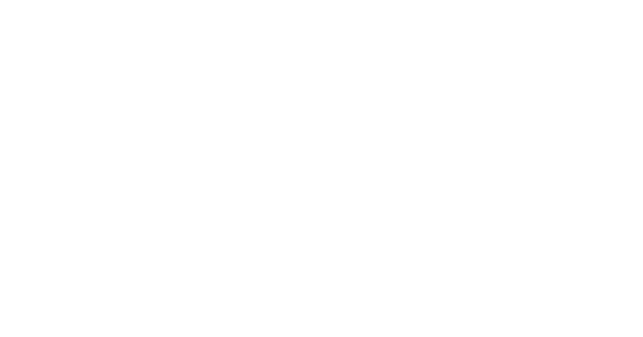
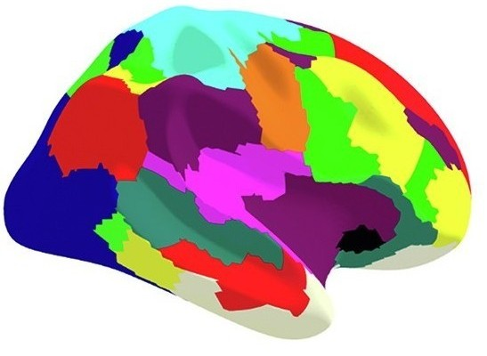

# A functional MRI study of APD

## Project' summary
### Introduction
This study explores brain network organization in children with Auditory Processing Disorder (APD) using resting-state fMRI data and graph theory approaches. Key findings include differences in brain hub architecture and functional connectivity between children with APD and healthy controls, particularly in regions related to auditory processing.

### Background
**Problem Statement:** Auditory Processing Disorder (APD) leads to difficulties in understanding speech despite normal hearing. The origins of APD symptoms are debated, with limited knowledge on the role of altered brain network topology.

**Objectives:** To investigate the functional brain network organization in children with APD and compare it with healthy controls using advanced neuroimaging techniques and network science approaches.

### Methods

#### Population for collecting multi-modal data
- 66 children (57 included) aged 8-14 years old (28 with diagnosis of APD and 29 healthy controls).

#### Data type
- functional MRI (fMRI) data acquired by multi-echo multi-band imaging sequences

#### Analysis Techniques
- Complex network analysis using graph theory, focusing on global and nodal network properties, and brain hub architecture

<!--  -->

<!--  -->

<!-- for compatibility with screen sizes -->
 

Figure 1: The pipeline used in this project for analyzing the imaging data.

### Results

#### Global Network Properties
- Both APD and control groups showed similar global network properties, but differences emerged in hub architecture

  
  

<!--

  
  

-->

Figure 2: Similar brain hub architecture and <a href="https://en.wikipedia.org/wiki/Large-scale_brain_network">intrinsic network model</a> in both APD and HC (Left) as shown by their global network metrics (right).

#### Key Findings
- Decreased participation coefficient in auditory cortical regions (<a href="https://www.sciencedirect.com/topics/neuroscience/superior-temporal-gyrus#:~:text=The%20superior%20temporal%20gyrus%20is,short%2Dterm%20auditory%20sensory%20memory.">bilateral superior temporal gyrus</a>) in children with APD, suggesting altered functional connectivity in specific brain networks (<a href="#target-image1">Figure 3: Left</a>).
- Positive correlation between left  <a href="https://www.sciencedirect.com/topics/neuroscience/parahippocampal-gyrus">parahippocampal gyrus </a> connectivity and auditory perception tasks in children with APD (<a href="#target-image2">Figure 3: Right</a>).

  
  

Figure 3: Major differences in brain regional network in APD and HC based on network metrics.

### Discussion
The findings suggest that children with APD have distinct alterations in brain network topology, particularly in regions associated with auditory processing. These results provide new insights into the neural mechanisms underlying APD and highlight the potential for using advanced neuroimaging and network science approaches to further our understanding of auditory processing disorders.

### Conclusion
This study contributes to the understanding of brain network alterations in APD, with potential implications for developing targeted interventions.

### Publication and Citation
**Read the article:** [here](https://www.sciencedirect.com/science/article/pii/S2213158222002042)

**Citation:** Alvand et al., (2022). Altered brain network topology in children with auditory processing disorder: A resting-state multi-echo fMRI study. *NeuroImage: Clinical, 35*, 103139.

### Funding
This study was funded by [Eisdell Moore Centre](https://www.emcentre.ac.nz/) and Faculty of Science's Research fund from [the University of Auckland](https://www.auckland.ac.nz/en.html).

# Data science utilized for this project
In this project, range of different approaches were used to treat the data such as formatting 4D imaging dataset (DICOM --> NIFTI), re-arranging data structure into brain Imaging Data structure (BIDS), quality inspection for evaluating spurious data (MRIQC), evaluation of de-noising pipelines, modeling data based on the theory of graph as well as statistical analysis.

## fMRI data
When acquiring functional MRI (fMRI) data from a scanner, the output includes a complex array of raw and processed data that captures both structural and functional aspects of the brain (Figure 4: Right).

In addition to functional data, a high-resolution structural MRI scan is often acquired. This provides a detailed map of the brain’s anatomy, which is used for aligning and localizing functional data to specific brain regions (Figure 4: Left).

 

Figure 5: Demonstration of anatomical MRI data, T1-image (left) and fMRI data (right)

## Raw fMRI Data (DICOM Files)
- Format: The raw data from the MRI scanner is typically stored in Digital Imaging and Communications in Medicine (DICOM) format. Each DICOM file contains a 2D slice of the brain, along with metadata (e.g., patient information, acquisition parameters like slice thickness, and time of acquisition).

- Slices and Volumes: The scanner acquires brain images in slices (2D planes) that are stacked together to form a 3D volume. A single fMRI acquisition consists of a series of 3D volumes captured over time (time series), producing a 4D dataset (3D volumes over time).

<!-- for compatibility with screen sizes -->
 

Figure 6: Depiction of fMRI data (3D) and its time series in FSL software

## Data Organization steps

- The raw [DICOM](https://www.dicomstandard.org/about) files are often converted into a more standardized format, such as the Neuroimaging Informatics Technology Initiative (NIfTI) format. NIfTI files contain the 3D brain volumes (or 4D volumes with time) and are more compatible with neuroimaging software for analysis.

- fMRI data is stored and organized using the Brain Imaging Data Structure (BIDS) format, a standardized way of organizing raw, processed, and metadata associated with neuroimaging datasets. This standard makes sharing and analysis more consistent and reproducible.

### 1. Data conversion and restructuring

[DICOM](https://www.dicomstandard.org/about) images were first reformatted to NIFTI using [dcm2niix](https://github.com/rordenlab/dcm2niix) and then re-structured into BIDS data structure using [niix2bids (Python)](https://github.com/benoitberanger/niix2bids). 

  
  

Figure 7: Transforming DICOM images (Left) to NIFTI format (4D data point) according to BIDS structure (Right)

## Computer Vision
### 1. Data Quality (QC)
In order to assess the quality of each data for pre-processing, first each NIFTI data was visualized and evaluated against their quality control (QC) parameters such as FD (a measurement of how much the head moves from one frame to the next), DIVARS (derivatives of FD), etc. as well as their [carpet plot](https://www.nature.com/articles/s41598-021-86402-z#:~:text=A%20%E2%80%9Ccarpet%20plot%E2%80%9D%20is%20a,of%20neuronal%20and%20physiological%20activity.) ( 2-dimensional plot of scaled fMRI voxel intensity values).

This pipeline is written in Bash and utilizes the [MRIQC](https://github.com/nipreps/mriqc/tree/master) (Python tool) for data quality assessment.

<!-- for compatibility with screen sizes -->
 

Figure 8: Visualized NIFTI data according to its quality measures

### 2. Image pre-processing

After discarding data points that did not meet the QC requirement, the remained data were undergone sequences of cleaning procedure, for example, image transformations, head motion correction, spatial normalization and spatial smoothing. This procedure utilizes [fMRIPrep](https://fmriprep.org/en/stable/), neuroimaging standard pipeline, which is based on [Nypype](https://nipype.readthedocs.io/en/latest/), [Nipy](https://nipy.org/), [Nitime](https://nipy.org/packages/nitime/index.html), [Nibabel](https://nipy.org/packages/nibabel/index.html) and [Nilearn](https://nipy.org/packages/nilearn/index.html).

<!-- for compatibility with screen sizes -->
 

Figure 9: Some of the fMRI image pre-processing steps

### 3. Selection of optimal de-noising pipelines

After each data was minimally processed, each data point were gone through further cleaning procedure to remove motion and confound signals from fMRI signal ([BOLD signal](https://radiopaedia.org/articles/bold-imaging)). For this, multiple existing de-noising pipelines were tested against efficiency and efficacy indices for accuracy performance. For instance, Figure 10 highlights the highest score of ICA-AROMA+8Phs+4GSR (High QC-FC, Low QC-FC dependence) among the rest of popular de-noising pipelines for the project's fMRI dataset.

<!-- for compatibility with screen sizes -->
 

Figure 10: Evaluating the accuracy of de-noising pipelines 

## Modeling the fMRI data 

### Network Neuroscience (Graph Theory)

- Network neuroscience is an interdisciplinary field that studies the brain as a complex network of interconnected regions. The brain's functional organization can be modeled as a network, where nodes represent specific brain regions, and edges represent the connections between them. The goal is to understand how brain regions interact to give rise to cognition, behavior, and neural processes
- Network neuroscience utilizes the graph theory which is a mathematical framework to study the properties and relationships of interconnected data points

  

Figure 11: Depiction of brain network (Left) and its associated regional connection in the diagram (Right). Each ball represents a node (i.e., brain region) and each line represents a connection (i.e, FC)

### Construction of the brain network

#### Defining Nodes
Nodes represent discrete brain regions, often identified using anatomical or functional atlases. Here in this project two functional atlases (templates) were used and applied to each individuals data for defining nodes in the network.

  
  

Figure 12: Two functional atlases were used for constructing the network, Gordon (333 nodes, Left) and Schaefer (300 nodes, Right)

##### Consistency assessment between nodal parcellation methods
This evaluation was conducted to assess if two random parcellation templates for defining network's nodes will indicate similar outcomes. For this, Test statistical map of brain regions in PC measure were calculated in Matlab and visualized using [BrainNet Viewer](https://uk.mathworks.com/matlabcentral/fileexchange/68881-brainnet-viewer). 

  

Figure 13: Comparison between Gordon (Top) and Schaefer (Bottom) atlases. Colors represent statistical scores for each region and are coded based on their negative or positive values. Regions with smaller t values are coded as blue and regions with greater t values are colored yellow.

#### Defining connections
Connections in the network are defined according to the statistical dependence of temporal correlation between the activity of pairwise brain regions. This connection is al so called Functional connectivity (FC), reveals how different parts of the brain communicate. 

Here in this project, Pearson correlation was used to estimate the FC between each pair of brain regions. Using [Scipy (pearsonr)](https://docs.scipy.org/doc/scipy/reference/generated/scipy.stats.pearsonr.html) and [Matlab (corrcoef)](https://www.mathworks.com/help/matlab/ref/corrcoef.html), the estimation of FC for each pair of regions was calculated. Results were saved in a connectivity matrix where each row represents the index of node (brain region) and the corresponding value represents FC. 

  
  

Figure 14: Functional connectivity matrix constructed by Gordon atlas (333 nodes, Left) and Schaefer atlas (300 nodes, Right)

## Evaluating the network 
For evaluation of information flow across the network and within each element (brain region), range of topological tests were conducted. 

### Global topology tests
Global network topology tests assess the overall efficiency of the network integration and segregation in transmitting the information. Metrics used for these tests are: Characteristic Path Length (CPL), Global Efficiency (GL), Mean Local Efficiency (MLE), Clustering Coefficient (CC), Modularity and Small-Worldness.

1. Small-Worldness:
A network property indicating a balance between local clustering (specialized processing within regions) and short path lengths (efficient communication across the network). It suggests that the brain is both segregated and integrated.
2. Global Efficiency:
A measure of how efficiently information is exchanged across the entire network. It reflects the ability of distant regions to communicate with each other quickly and effectively.
3. Characteristic Path Length (CPL):
It measures how easily or quickly information can travel between different regions of the network.In brain networks, shorter path lengths often suggest more efficient communication between brain regions, while longer path lengths may indicate disruptions or inefficiencies.
4. Modularity:
The degree to which a network can be divided into modules or communities of nodes that are more densely connected to each other than to other nodes. In the brain, this can indicate specialized functional processing areas.
5. Clustering Coefficient:
A measure of how interconnected a node's neighbors are. In a brain network, it indicates how likely it is that the neighbors of a brain region are also connected to each other, forming a cluster.
6. Betweenness Centrality (BC):
A measure of how often a node acts as a bridge along the shortest path between other nodes. High BC means the region plays a crucial role in facilitating communication between different parts of the brain.
7. Mean Local Efficiency: 
Local efficiency measures the efficiency of information transfer within the neighborhood of a node. Local efficiency reflects fault tolerance — how well a network can maintain communication if one node is disrupted.It measures segregated processing, how well information can flow between neighboring brain regions without relying on long-distance connections.

  

Figure 15: Depiction of network's evaluation metrics

### Local topology tests

#### Network community detection
Community detection is an evaluation method to identify modular organization in a network. Using Matlab, [Louvain algorithm](https://en.wikipedia.org/wiki/Louvain_method) were implemented in order to identify the functional systems (i.e., modules, networks, communities) in the brain networks. 

  

Figure 16: Community detection steps in the brain network (A). Modular organizations (Functional systems) that were revealed in the brain network of APD and HC (B).

#### Backbone consistency (Hub model)

To test the consistency a network, two measures of WMZ and PC (PC normalized) were used.

1. Within module degree (WMZ): This metric indicates how integrative a brain region is (i.e., hub) within a particular functional module.

2. Participation coefficient (PC): This measure quantifies how a node’s connections are distributed across different modules. This measure reflects how a brain region interacts with multiple functional networks (i.e., modules), potentially serving as a connector hub (connecting two modules) or provincial hub (densely connected only within a module). 

  

Figure 17: Depiction of hub in a random graph (A). Brain hub organization in APD and HC (B)

## Statistical evaluation

### Connection consistency test

  

Figure 18: Depiction of NBS pipeline for connectivity test (A). Connection assessment implemented in the project (B)

### Multivariate tests

### Correlation tests

## Visualization

