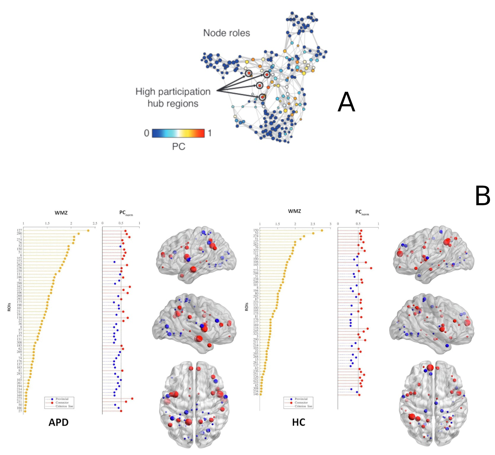

# Interactive brain systems in children with APD

## Project's summary

 

### Introduction
This study explores brain network organization in children with Auditory Processing Disorder (APD) using resting-state fMRI data and graph theory approaches. Key findings include differences in brain hub architecture and functional connectivity between children with APD and healthy controls, particularly in regions related to auditory processing.

### Background
**Problem Statement:** Auditory Processing Disorder (APD) leads to difficulties in understanding speech despite normal hearing. The origins of APD symptoms are debated, with limited knowledge on the role of altered brain network topology.

**Objectives:** To investigate the functional brain network organization in children with APD and compare it with healthy controls using advanced neuroimaging techniques and network science approaches.

### Methods

#### Population for collecting multi-modal data
- 66 children (57 included) aged 8-14 years old (28 with diagnosis of APD and 29 healthy controls).

#### Data type
- functional MRI (fMRI) data acquired by multi-echo multi-band imaging sequences

#### Analysis Techniques
- Complex network analysis using graph theory, focusing on global and nodal network properties, and brain hub architecture

<!--  -->

<!--  -->

<!-- for compatibility with screen sizes -->
 

Figure 1: The pipeline used in this project for analyzing the imaging data.

### Results

#### Global Network Properties
- Both APD and control groups showed similar global network properties, but differences emerged in hub architecture

  
  

<!--

  
  

-->

Figure 2: Similar brain hub architecture and <a href="https://en.wikipedia.org/wiki/Large-scale_brain_network">intrinsic network model</a> in both APD and HC (Left) as shown by their global network metrics (right).

#### Key Findings
- Decreased participation coefficient in auditory cortical regions (<a href="https://www.sciencedirect.com/topics/neuroscience/superior-temporal-gyrus#:~:text=The%20superior%20temporal%20gyrus%20is,short%2Dterm%20auditory%20sensory%20memory.">bilateral superior temporal gyrus</a>) in children with APD, suggesting altered functional connectivity in specific brain networks (<a href="#target-image1">Figure 3: Left</a>).
- Positive correlation between left  <a href="https://www.sciencedirect.com/topics/neuroscience/parahippocampal-gyrus">parahippocampal gyrus </a> connectivity and auditory perception tasks in children with APD (<a href="#target-image2">Figure 3: Right</a>).

  
  

Figure 3: Major differences in brain regional network in APD and HC based on their network metrics.

### Discussion
The findings suggest that children with APD have distinct alterations in brain network topology, particularly in regions associated with auditory processing. These results provide new insights into the neural mechanisms underlying APD and highlight the potential for using advanced neuroimaging and network science approaches to further our understanding of auditory processing disorders.

### Conclusion
This study contributes to the understanding of brain network alterations in APD, with potential implications for developing targeted interventions.

### Publication and Citation
**Read the article:** [here](https://www.sciencedirect.com/science/article/pii/S2213158222002042)

**Citation:** Alvand et al., (2022). Altered brain network topology in children with auditory processing disorder: A resting-state multi-echo fMRI study. *NeuroImage: Clinical, 35*, 103139.

### Funding
This study was funded by [Eisdell Moore Centre](https://www.emcentre.ac.nz/) and Faculty of Science's Research fund from [the University of Auckland](https://www.auckland.ac.nz/en.html).

# Data science utilized for this project
In this project, range of different approaches were used to treat the data such as formatting 4D imaging dataset (DICOM --> NIFTI), re-arranging data structure into brain Imaging Data structure (BIDS), quality inspection for evaluating spurious data (MRIQC), evaluation of de-noising pipelines, modeling data based on the theory of graph as well as statistical analysis.

## fMRI data
When acquiring functional MRI (fMRI) data from a scanner, the output includes a complex array of raw and processed data that captures both structural and functional aspects of the brain (Figure 4: Right).

In addition to functional data, a high-resolution structural MRI scan is often acquired. This provides a detailed map of the brain’s anatomy, which is used for aligning and localizing functional data to specific brain regions (Figure 4: Left).

 

Figure 5: Demonstration of anatomical MRI data, T1-image (left) and fMRI data (right)

## Raw fMRI Data (DICOM Files)
- Format: The raw data from the MRI scanner is typically stored in Digital Imaging and Communications in Medicine (DICOM) format. Each DICOM file contains a 2D slice of the brain, along with metadata (e.g., patient information, acquisition parameters like slice thickness, and time of acquisition).

- Slices and Volumes: The scanner acquires brain images in slices (2D planes) that are stacked together to form a 3D volume. A single fMRI acquisition consists of a series of 3D volumes captured over time (time series), producing a 4D dataset (3D volumes over time).

<!-- for compatibility with screen sizes -->
 

Figure 6: Depiction of fMRI data (3D) and its time series in FSL software

## Data Organization steps

- The raw [DICOM](https://www.dicomstandard.org/about) files are often converted into a more standardized format, such as the Neuroimaging Informatics Technology Initiative (NIfTI) format. NIfTI files contain the 3D brain volumes (or 4D volumes with time) and are more compatible with neuroimaging software for analysis.

- fMRI data is stored and organized using the Brain Imaging Data Structure (BIDS) format, a standardized way of organizing raw, processed, and metadata associated with neuroimaging datasets. This standard makes sharing and analysis more consistent and reproducible.

### 1. Data conversion and restructuring

[DICOM](https://www.dicomstandard.org/about) images were first reformatted to NIFTI using [dcm2niix](https://github.com/rordenlab/dcm2niix) and then re-structured into BIDS data structure using [niix2bids (Python)](https://github.com/benoitberanger/niix2bids). 

  
  

Figure 7: Transforming DICOM images (Left) to NIFTI format (4D data point) according to BIDS structure (Right)

## Computer Vision
### 1. Data Quality (QC)
In order to assess the quality of each data for pre-processing, first each NIFTI data was visualized and evaluated against their quality control (QC) parameters such as FD (a measurement of how much the head moves from one frame to the next), DIVARS (derivatives of FD), etc. as well as their [carpet plot](https://www.nature.com/articles/s41598-021-86402-z#:~:text=A%20%E2%80%9Ccarpet%20plot%E2%80%9D%20is%20a,of%20neuronal%20and%20physiological%20activity.) ( 2-dimensional plot of scaled fMRI voxel intensity values).

This pipeline is written in Bash and utilizes the [MRIQC](https://github.com/nipreps/mriqc/tree/master) (Python tool) for data quality assessment.

<!-- for compatibility with screen sizes -->
 

Figure 8: Visualized NIFTI data according to its quality measures

### 2. Image pre-processing

After discarding data points that did not meet the QC requirement, the remained data were undergone sequences of cleaning procedure, for example, image transformations, head motion correction, spatial normalization and spatial smoothing. This procedure utilizes [fMRIPrep](https://fmriprep.org/en/stable/), neuroimaging standard pipeline, which is based on [Nypype](https://nipype.readthedocs.io/en/latest/), [Nipy](https://nipy.org/), [Nitime](https://nipy.org/packages/nitime/index.html), [Nibabel](https://nipy.org/packages/nibabel/index.html) and [Nilearn](https://nipy.org/packages/nilearn/index.html).

<!-- for compatibility with screen sizes -->
 

Figure 9: Some of the fMRI image pre-processing steps

### 3. Selection of optimal de-noising pipelines

After each data was minimally processed, each data point were gone through further cleaning procedure to remove motion and confound signals from fMRI signal ([BOLD signal](https://radiopaedia.org/articles/bold-imaging)). For this, multiple existing de-noising pipelines were tested against efficiency and efficacy indices for accuracy performance. For instance, Figure 10 highlights the highest score of ICA-AROMA+8Phs+4GSR (High QC-FC, Low QC-FC dependence) among the rest of popular de-noising pipelines for the project's fMRI dataset.

<!-- for compatibility with screen sizes -->
 

Figure 10: Evaluating the accuracy of de-noising pipelines 

## Modeling the fMRI data 

### Network Neuroscience (Graph Theory)

For modeling the data, I used complex network analysis (based on graph theory) to study brain networks because it provides powerful tools to quantify and model the complex relationships between different brain regions. The brain is an intricate, interconnected system, and graph theory offers a structured way to analyze these connections, helping us understand how the brain functions at both local and global levels.

  

Figure 11: Depiction of brain network (Left) and its associated regional connection in the diagram (Right). Each ball represents a node (i.e., brain region) and each line represents a connection (i.e, FC)

### Representation of the Brain as a Network:

- The brain can be modeled as a network, where nodes represent brain regions (e.g., specific cortical areas) and edges represent the connections between them (based on correlations in activity).
- Graph theory provides a natural framework for representing the brain’s architecture as a network, allowing us to explore functional relationships between regions.

#### Defining Nodes
Nodes represent discrete brain regions, often identified using anatomical or functional atlases. Here in this project two functional atlases (templates) were used and applied to each individual's data for defining nodes in the network.

  
  
    

Figure 12: Two functional atlases were used for constructing the network, Gordon (333 nodes, Left) and Schaefer (300 nodes, Right)

##### Consistency assessment between nodal parcellation methods
This evaluation was conducted to assess if two random parcellation methods for defining nodes will indicate similar outcomes. For this, Test statistical map of brain regions in PC measure were calculated in Matlab and visualized using [BrainNet Viewer](https://uk.mathworks.com/matlabcentral/fileexchange/68881-brainnet-viewer). 

  

Figure 13: Comparison between Gordon (Top) and Schaefer (Bottom) atlases. Colors represent statistical scores for each region and are coded based on their negative or positive values. Regions with smaller t values are coded as blue and regions with greater t values are colored yellow.

#### Defining connections
Connections in the network are defined according to the statistical dependence of temporal correlation between the activity of pairwise brain regions. This connection is also called Functional connectivity (FC), reveals how different parts of the brain communicate. 

Here in this project, Pearson correlation was used to estimate the FC between each pair of brain regions. Using [Scipy (pearsonr)](https://docs.scipy.org/doc/scipy/reference/generated/scipy.stats.pearsonr.html) and [Matlab (corrcoef)](https://www.mathworks.com/help/matlab/ref/corrcoef.html), the estimation of FC for each pair of regions was calculated. Results were saved in a connectivity matrix where each row represents the index of node (brain region) and the corresponding value represents FC. 

  
  

Figure 14: Functional connectivity matrix constructed by Gordon atlas (333 nodes, Left) and Schaefer atlas (300 nodes, Right)

#### Network's density assessment (Network's pruning):
Density thresholding is a method used to control the number of connections (edges) in a brain network, ensuring that the network remains sparse and avoids including weak or noisy connections.

Why Use Density Thresholding?
- Control for Network Sparsity: Ensures that comparisons between subjects or groups are fair by keeping the number of connections consistent.
- Remove Weak Connections: Filters out weak and potentially spurious connections that may arise from noise in the data.
- Focus on Stronger Relationships: Highlights the most relevant and functionally significant connections within the brain, which are often most affected by neurological conditions.

For this project, I computed connectivity matrices with a network density ranging from 1 to 40% (with a 1% increment). This means for a density threshold of 10%, only the top 10% of connections (based on their strength) are kept, and the remaining 80% are set to zero, effectively pruning the network. All the scripting were written in Matlab using network sparsity function.

  

Figure 15: Depiction of network's pruning procedure

## Evaluating the network 
For evaluation of information flow across the network and within each element (brain region), range of topological tests were conducted. 

### Evaluation of Global and Local Network Properties
- Complex network analysis helps measure global properties, such as how efficiently information flows across the entire brain (e.g., global efficiency, characteristic path length), and local properties, such as how well information is processed within localized regions (e.g., [clustering coefficient](https://www.sciencedirect.com/topics/computer-science/clustering-coefficient), [Betweenness Centrality](https://www.sciencedirect.com/topics/computer-science/betweenness-centrality#:~:text=In%20subject%20area%3A%20Computer%20Science,their%20position%20in%20these%20paths.), [Modularity](https://en.wikipedia.org/wiki/Modularity_(networks)), [local efficiency](https://en.wikipedia.org/wiki/Efficiency_(network_science)#:~:text=The%20concept%20of%20efficiency%20can,failure%20on%20a%20small%20scale.)).
- This distinction between global and local properties allows us to explore both large-scale brain integration and localized processing (segregation) in a unified framework.

For testing global and local properties of the brain network, Using Matlab and Python ([Networkx](https://networkx.org/documentation/stable/index.html)), I wrote scripts to implement network metrics for calculating subjects' connectivity matrices. 

  

Figure 16: Depiction of network's evaluation metrics and its application for the brain network modeling

### Quantifying Network Organization:
- Graph theory metrics (such as degree, Participation Coefficient and modularity) offer ways to quantify the brain’s network organization, helping to identify key regions (hubs), communities (modules), and the overall efficiency of communication.
- These metrics allow us to detect abnormalities in brain networks associated with neurological or psychiatric disorders (e.g., Alzheimer’s disease, schizophrenia, or Auditory Processing Disorder).

#### Network community detection (Modularity)
- Community detection is an evaluation method to identify modular organization in a network. Using Matlab, [Louvain algorithm](https://en.wikipedia.org/wiki/Louvain_method) were implemented in order to identify the functional systems (i.e., modules, networks, communities) in the brain networks. This process was repeated [1000 times](https://www.sciencedirect.com/science/article/abs/pii/B9780323852807000166) to achieve its highest accuracy for defining the network's modules.

  

Figure 17: Community detection steps in the brain network (A). Modular organizations (Functional systems) that were revealed in the brain network of APD and HC (B).

- Community consistency tests across different network's densities
In order to assess whether the community (module) detection is consistent across all the density thresholds, I wrote a Matlab script to implement community algorithm across all densities (i.e., 1-40%) and all subjects for pairwise comparison.

  

Figure 18: Modular organization across network density thresholds for APD and HC subjects.

#### Evaluation of network's Backbone (Hub model)
Some brain regions, known as hubs, are highly connected and crucial for global information flow. Complex network analysis identifies these hubs and assesses their importance in brain function. Changes in hub structure or function are often linked to cognitive deficits or brain disorders, making it critical to identify these key nodes.

- To test the consistency a network, two measures of WMZ and PC (PC normalized) were used.

1. Within module degree (WMZ): This metric indicates how integrative a brain region is (i.e., hub) within a particular functional module.

2. Participation coefficient (PC): This measure quantifies how a node’s connections are distributed across different modules. This measure reflects how a brain region interacts with multiple functional networks (i.e., modules), potentially serving as a connector hub (connecting two modules) or provincial hub (densely connected only within a module). 

  

Figure 19: Depiction of hub in a random graph (A). Brain hub organization in APD and HC (B)

## Statistical evaluation

### Connection consistency test

[Network-Based Statistics (NBS)](https://sites.google.com/site/bctnet/network-based-statistic-toolbox) is a powerful statistical method used to identify differences in brain networks between groups (e.g., patients vs. controls) or conditions (e.g., pre- vs. post-treatment). NBS specifically tests for subnetworks (clusters of connected edges or nodes) that show statistically significant differences, rather than examining each connection independently.NBS is widely used to detect subnetworks that are altered in neurological and psychiatric disorders, such as schizophrenia, autism, Alzheimer's disease, and Auditory Processing Disorder (APD). 

For this project, NBS were utilized to assess the alteration in functional connectivity within the brain network of APDs compared to HCs. I wrote a Matlab script for implementing the algorithm for each subject and also a Bash script to optimize the pipeline across all subjects' data [batch processing](https://en.wikipedia.org/wiki/Batch_processing).

  

Figure 20: Depiction of general NBS pipeline for connectivity assessment (A) and the pipeline was implemented for this project (B).

### Multivariate tests (GLM)

General Linear Model (GLM) is a flexible statistical method used to model the relationship between one or more predictor variables and a response variable. In the context of neuroimaging and brain network studies, GLM is often used to analyze connectivity data, brain activity patterns, and their associations with clinical or cognitive measures.

Formula: Y=Xβ+ϵ
- Y: The response variable (e.g., brain connectivity measures).
- X: The design matrix containing predictor variables (e.g., group membership, age).
- β: The coefficients representing the effect sizes of the predictors.
- ϵ: The error term.

Applications in Brain Network Studies: 

- Group Comparisons: GLM is used to compare brain connectivity metrics (e.g., clustering coefficient, path length) between groups, such as patients and healthy controls.
- Co-variate Adjustments: It allows for adjustment of co-variates such as age, gender, or head motion, which might confound the results.
- Correlation Analysis: GLM can model how brain connectivity relates to cognitive or clinical scores, providing insights into the relationship between brain function and behavior.
Statistical Analysis Steps:

Procedure: 
1. Model Specification: Define the design matrix with variables of interest (e.g., group differences).
2. Estimation: Estimate the coefficients (β) using the data.
3. Hypothesis Testing: Perform statistical tests (e.g., t-tests, F-tests) on the coefficients to determine the significance of the predictors.
4. Post-Hoc Analysis: after identifying significant effects, post-hoc analyses (e.g., Bonferroni correction) are used to control for multiple comparisons and refine the results.

For this project, all the statistical codes were written in Matlab and Bash by implementing [PALM toolbox](https://github.com/andersonwinkler/PALM), the area under the curve (AUC) across the sparsity range of 10-40% was calculated to assess whether there are group differences in network measures. Two-sample t-tests assuming unequal variances between APD and HC groups were carried out on the AUC of each network measure in the PALM. The randomization was repeated 20,000 times, and the 95% confidence interval was calculated and used as the critical value of significance testing (p < 0.05). The effect of age as a nuisance confound was also controlled during the randomization (demeaned). To control for multiple comparisons, all p values were corrected across ROIs and network measures (PALM: -corrmod, -fdr) using false discovery rate (FDR) correction (q < 0.05). 

  

Figure 20: Depiction of statistical analysis implemented in this project as mentioned above.

### Correlation test

[Partial Correlation](https://en.wikipedia.org/wiki/Partial_correlation): Measures the correlation between two variables while controlling for the effects of one or more additional variables.Helps isolate the direct relationship between brain metrics and outcomes, accounting for confounding factors like age or gender.

- Applications in Brain Network:
1. Identifying Biomarkers: linking brain connectivity patterns with symptoms or behavioral measures, identifying potential biomarkers of neurological conditions.
2. Understanding Brain-Behavior Relationships: By examining how network alterations are associated with clinical measures, it helps to gain insights into the functional impact of connectivity changes.

- Implication:
1. Significance Testing: Correlation coefficients are tested for statistical significance to determine whether the observed relationships are unlikely to have occurred by chance.
2. Effect Size: The strength of the correlation (e.g., weak, moderate, strong) provides information on how meaningful the association is.

- In this project, using Matlab functions, a partial correlation analysis was performed to assess the association between network measures and behavioral variables. Permutation was set to 20000 randomizations and the effect of age and group were controlled. All p values were corrected using FDR across ROIs and network measures to control for multiple comparisons. 
 
 

  

Figure 21: Depiction of correlation analysis in the study 

### Data-driven meta-analytical test
This technique combine data-driven approaches with meta-analysis techniques to identify consistent patterns across multiple studies. Unlike traditional hypothesis-driven analyses, these tests do not rely on predefined hypotheses but instead explore data to uncover significant patterns.

- Application:
1. Exploring Brain-Behavior Relationships: Examine how brain activation relates to psychological terms across studies.
2. Hypothesis Validation: Validate findings from individual studies against large-scale meta-analytical data.

For conducting meta-analytical test, [Neurosynth python package](https://github.com/neurosynth/neurosynth) were used to understand how altered brain regions are associated with various psychological and neurological functions by synthesizing thousands of fMRI studies. 

This pipeline includes:
- Reading altered brain regions in APD compared to HC that identified by network metrics (i.e., participation coefficient).
- Extract Related Cognitive Terms to find cognitive terms associated with these brain regions (e.g., Superior Temporal Gyrus)
- Analyze cognitive associations across two parcellation methods used in the study (i.e., Gordon and Schaefer parcellations)
- Generate word clouds for the cognitive terms associated with each parcellation.

 

  

Figure 22: Visualizing brain regions and its cognitive terms based on two atlases, Gordon (A), Schaefer (B)

